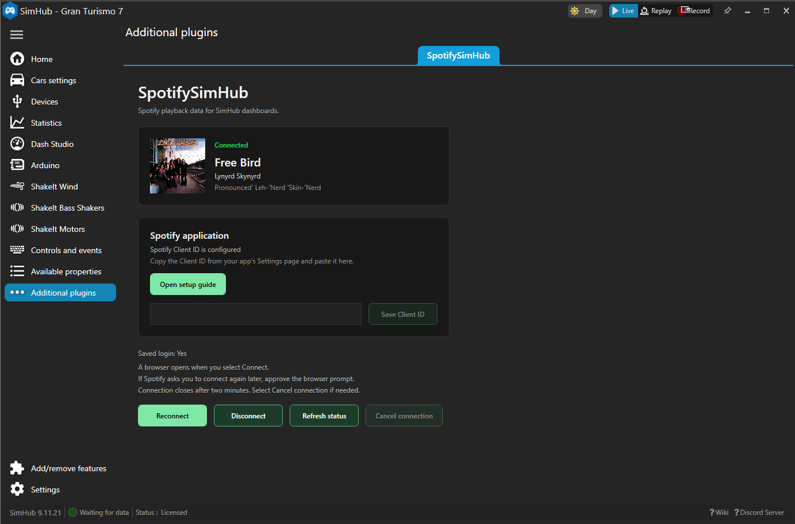
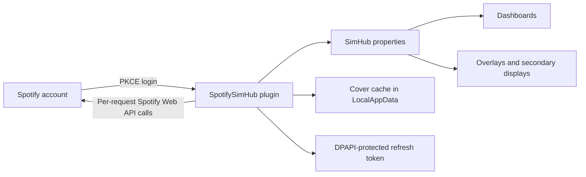

# SpotifySimHub

Bring the music you are listening to into your SimHub dashboards.

SpotifySimHub is a Windows plugin that exposes the current Spotify track, artist, album, and cover art as native SimHub properties. Because it reads the Spotify account's playback state through the Web API, it can follow playback on Spotify Connect devices such as a PlayStation 5. It is not limited to audio playing on the SimHub computer.



## Why this plugin exists

SimHub is excellent at combining telemetry and external data into one dashboard, but Spotify playback information is not available as a built-in data source. That leaves users with awkward workarounds: manually updated text, device-specific integrations, or custom scripts that do not behave like normal SimHub properties.

SpotifySimHub fills that gap. It provides one small, local integration that:

- behaves like a regular SimHub plugin;
- works with existing dashboard expressions and image controls;
- follows account-level playback across supported Spotify Connect devices;
- keeps the property names stable across plugin updates;
- reconnects with a saved Spotify session;
- does not require a client secret;
- keeps tokens on the local Windows account;
- avoids opening a login page every time SimHub starts.

The goal is simple: music information should be as easy to place on a SimHub dashboard as speed, RPM, or any other property.

## What it provides

- Current artist
- Current track
- Current album
- Combined `Artist - Track` text
- Stable local cover-art path
- WPF cover image for compatible SimHub controls
- Secure Spotify browser login
- Saved login between SimHub sessions
- One-time automatic reauthorization when Spotify expires a saved login
- DPAPI-protected token storage for the current Windows user
- Clear Connect, Disconnect, and Refresh status controls
- Built-in Spotify Developer setup guide with copyable redirect URI
- A two-minute authorization timeout and immediate Cancel control
- Adaptive polling, rate-limit handling, bounded retry backoff, cancellation, and request timeouts
- No automatic deployment into SimHub during build

## How it works



At startup, the plugin checks for a saved refresh token and attempts to restore the Spotify session. If no login exists, it reports `Login required` and waits for the user to press Connect. A missing login never opens the browser automatically.

Spotify refresh tokens expire six months after authorization. When Spotify explicitly rejects an existing token as expired, SpotifySimHub deletes it and opens the PKCE authorization flow once so the user can approve a new session. Ordinary network errors never open the browser.

Playback is polled at a controlled adaptive interval: no more often than every three seconds during active playback and every five seconds while playback is paused or absent. Spotify's `429 Retry-After` response and bounded failure backoff can slow polling further. Bearer authorization is added only to individual Spotify API requests, and never to the token endpoint. Cover art is accepted only from HTTPS image responses, limited to 5 MB, decoded before use, and written atomically to local cache files.

## Dash Studio properties

After SpotifySimHub is connected, these properties are available in the Dash Studio property picker. SimHub adds the `SpotifyPlugin` prefix when a property is used in a formula. Use the exact expressions shown below.

| Property | Description |
| --- | --- |
| `[SpotifyPlugin.Spotify.Album]` | Album name |
| `[SpotifyPlugin.Spotify.Artist]` | Artist name |
| `[SpotifyPlugin.Spotify.Cover]` | Stable local path to the cached JPG cover image |
| `[SpotifyPlugin.Spotify.CoverDash]` | Changing JPG path for Dash Studio image components, including mobile dashboards |
| `[SpotifyPlugin.Spotify.CoverImage]` | `BitmapImage` for local WPF image controls |
| `[SpotifyPlugin.Spotify.CurrentTrack]` | Combined text in the format `Artist - Track` |
| `[SpotifyPlugin.Spotify.Track]` | Track name only |

The plugin registers the `Spotify.*` property names, and SimHub exposes them in formulas below the `SpotifyPlugin` prefix. The six original property names remain compatibility contracts. `Spotify.CoverDash` is an additional property designed for Dash Studio.

### Add track information to a dashboard

1. Open **Dash Studio** and edit or create a dashboard.
2. Add a **Text** component.
3. Select the component and open the `fx` binding for **Text**.
4. Select **Formula**.
5. Select `SpotifyPlugin.Spotify.CurrentTrack` in the property picker, or enter:

```text
[SpotifyPlugin.Spotify.CurrentTrack]
```

Use `[SpotifyPlugin.Spotify.Artist]`, `[SpotifyPlugin.Spotify.Track]`, and `[SpotifyPlugin.Spotify.Album]` the same way when each value needs its own text component.

### Add cover art to a computer or mobile dashboard

1. Add an **Image from file** component. Use this specific component for a dynamic cover.
2. Select it and open the `fx` binding for **Image Path**.
3. Select **Formula**.
4. Select `SpotifyPlugin.Spotify.CoverDash` in the property picker, or enter:

```text
[SpotifyPlugin.Spotify.CoverDash]
```

5. Resize the component and choose the preferred image stretch mode.
6. Save the dashboard and open it on the computer, phone, or tablet.

`[SpotifyPlugin.Spotify.CoverDash]` alternates between two local JPG files when the album art changes. This makes SimHub send each new image to web dashboards. `[SpotifyPlugin.Spotify.Cover]` remains the stable local JPG path for other PC integrations. `[SpotifyPlugin.Spotify.CoverImage]` is a WPF `BitmapImage` and is not transported to a phone browser.

## Requirements

- Windows
- SimHub 9.x
- A Spotify Premium account
- A Spotify developer application
- .NET Framework 4.8
- Visual Studio or Build Tools with the .NET Framework MSBuild toolchain only when building from source

## Why a Spotify developer application is required

Spotify authorization has two separate identities:

1. your normal Spotify account identifies the listener and grants access to the current playback state;
2. a Client ID identifies SpotifySimHub as the application requesting that access.

The plugin uses Authorization Code Flow with PKCE, so it never needs a Client Secret. A Client ID is still required by Spotify for every authorization request.

New Spotify applications run in Development Mode. Spotify currently limits these applications to personal development and a small allowlist, which makes one shared Client ID unsuitable for a generally distributed community plugin. A personal SpotifySimHub build therefore uses a Client ID created under the user's own Spotify account.

This extra setup is what allows SpotifySimHub to read playback from the Spotify account rather than only inspecting local Windows audio. It is also why the plugin can detect a track playing on a PlayStation 5 or another supported Spotify Connect device.

See [INSTALLATION.md](INSTALLATION.md) for the complete guided setup.

## Spotify application setup

1. Sign in to the [Spotify Developer Dashboard](https://developer.spotify.com/dashboard) with the same Spotify account used for playback.
2. Accept the current Spotify Developer Terms if prompted.
3. Select **Create app**.
4. Enter an app name such as `SpotifySimHub`.
5. Enter a short description such as `Personal Spotify playback data for SimHub`.
6. Add this exact redirect URI:

```text
http://127.0.0.1:9877/callback
```

7. Select **Web API** when Spotify asks which API the app will use.
8. Accept the terms and create the app.
9. Open the app's settings and copy the value labelled Client ID. Paste it into SpotifySimHub after installation.

Keep the redirect URI exactly as shown in the guide. The Client ID remains the same, so the app setup only needs to be completed once.

## Install from a release

Download the current installer or ZIP package from the [latest SpotifySimHub release](https://github.com/Geforce81/SpotifySimHub/releases/latest).

SpotifySimHub is distributed in two neutral packages:

- `SpotifySimHub-<version>-Setup.exe` asks for the SimHub installation folder, verifies that it contains `SimHubWPF.exe`, installs the plugin DLL, and supports upgrades and uninstall.
- `SpotifySimHub-<version>-win.zip` contains the plugin DLL plus a quick-start guide and third-party notices. Extract its contents directly into the folder containing `SimHubWPF.exe`.

After either installation, open SpotifySimHub under Additional plugins, enter the personal Spotify Client ID once, and press Connect. Users do not need Visual Studio, MSBuild, NuGet, or a Client Secret.

The published EXE installer is not Authenticode-signed yet, so Windows may identify it as an unknown publisher. Verify the provided SHA-256 checksum if desired. The ZIP remains the transparent manual alternative.

### Build the release packages

```powershell
powershell.exe -NoProfile -ExecutionPolicy Bypass `
  -File .\Build-Package.ps1 `
  -RequireInstaller
```

The script:

1. rebuilds Release with Client ID embedding explicitly disabled;
2. rejects SimHub-owned assemblies in the output;
3. stages the exact package allowlist;
4. creates the ZIP and, when Inno Setup is available, the EXE installer;
5. creates a SHA-256 checksum beside each artifact.

Generated packages are written to `dist\` and are intentionally not tracked by Git.

## Build and install from source

### 1. Configure the local SimHub build path

Copy the example properties file:

```powershell
Copy-Item `
  .\SpotifySimHub\SpotifyClientId.example.props `
  .\SpotifySimHub\SpotifyClientId.local.props
```

Edit `SpotifyClientId.local.props` and:

1. set `SimHubInstallPath` to the SimHub installation directory;
2. keep the trailing directory separator in the SimHub path.

`SpotifyClientId` is an optional developer-only Debug fallback. Release builds are neutral by default and users enter the Client ID in SimHub. The local file is ignored by Git. Never commit a configured value or include it in logs, screenshots, issues, or pull requests.

### 2. Restore dependencies

```powershell
nuget restore .\SpotifySimHub\SpotifySimHub.sln
```

### 3. Build

Debug:

```powershell
& "C:\Program Files\Microsoft Visual Studio\18\Community\MSBuild\Current\Bin\MSBuild.exe" `
  ".\SpotifySimHub\SpotifySimHub.csproj" `
  /t:Rebuild `
  /p:Configuration=Debug `
  /p:Platform=AnyCPU `
  /m
```

Release:

```powershell
& "C:\Program Files\Microsoft Visual Studio\18\Community\MSBuild\Current\Bin\MSBuild.exe" `
  ".\SpotifySimHub\SpotifySimHub.csproj" `
  /t:Rebuild `
  /p:Configuration=Release `
  /p:Platform=AnyCPU `
  /m
```

Build output:

- `SpotifySimHub\bin\Debug\SpotifySimHub.dll`
- `SpotifySimHub\bin\Release\SpotifySimHub.dll`

### 4. Install the local build

1. Close SimHub.
2. Copy `SpotifySimHub.dll` from the selected output directory to the SimHub installation directory.
3. Start SimHub and open SpotifySimHub under Additional plugins.

The project deliberately has no post-build deployment command. Building the project never modifies the SimHub installation.

Newtonsoft.Json is distributed beside `SpotifySimHub.dll` as a plugin-owned runtime dependency. SimHub reflects over plugin types before constructing the plugin, so this dependency must be available while the plugin assembly is loaded.

## Using the plugin

### Connect

On first use, select **Open setup guide** for an in-plugin walkthrough of Spotify Developer account setup, the exact app fields, and the redirect URI. Step 3 contains its own masked Client ID field and **Save Client ID** button. The separate field on the main settings page remains available for manual setup and later changes.

Press **Connect** to open Spotify in the browser. Sign in, approve the prompt, and return to SimHub. The plugin then starts updating the playback data and remembers the connection for future SimHub sessions.

The authorization attempt times out after two minutes if it is not completed. If the Spotify browser tab is closed, select **Cancel connection** in SimHub to stop immediately and re-enable the other controls.

If Spotify asks you to connect again later, simply approve the browser prompt.

### Refresh status

Press **Refresh status** to refresh the saved session if necessary and immediately update the current playback state.

### Disconnect

Press **Disconnect** to:

- cancel active login, refresh, polling, and cover work;
- clear access and refresh tokens from memory;
- remove the saved refresh token;
- clear track, artist, album, and cover properties;
- remain disconnected until Connect is pressed again.

Disconnect never starts a new browser login.

## Local data and privacy

SpotifySimHub stores its runtime data under:

```text
%LOCALAPPDATA%\SpotifySimHub
```

The saved login is protected by Windows for the current user and remains on the computer. Login details and the configured Client ID are not written to plugin logs.

Cover art is cached as local JPG files so dashboards do not need to depend directly on a changing remote URL. `cover.jpg` provides a stable path, while two alternating Dash Studio files make changed artwork refresh on web and mobile dashboards.

## Troubleshooting

### Build reports missing local configuration

Create `SpotifyClientId.local.props` from the example and configure `SimHubInstallPath`. A Spotify Client ID is no longer required at build time.

### SpotifySimHub reports Spotify Client ID required

Copy the value labelled Client ID from the Spotify Developer Dashboard, paste it into the masked field on the plugin settings page, and press **Save Client ID**.

### SimHub assemblies cannot be resolved

Verify that `SimHubInstallPath`:

- points to the directory containing `SimHub.Plugins.dll`;
- ends with a directory separator;
- is accessible to the current Windows user.

### Spotify login does not complete

- Confirm that the Spotify application contains the exact loopback redirect URI.
- Check that another application is not using local port `9877`.
- Return to SimHub and retry if the authorization attempt timed out or was cancelled.

### A browser opens after a previously working saved login expires

Approve the Spotify browser prompt to restore the saved connection.

### No track is displayed

Spotify may have no active playback. Start playback on a Spotify device and press Refresh status.

### Cover art does not update

The plugin accepts only valid HTTPS image responses up to 5 MB. An invalid replacement is rejected so that a partially written image cannot replace the last valid cache file.

## Project status

The automated and offline verification covers:

- Debug and Release compilation;
- PKCE generation;
- authorization timeout configuration;
- per-request bearer authorization;
- expired-refresh-token detection and one-time reauthorization routing;
- `429 Retry-After` handling;
- adaptive three/five-second polling;
- DPAPI token storage and plaintext migration;
- cover content-type, size, decode, and atomic-write behavior;
- preservation of all six original SimHub property names plus `Spotify.CoverDash`;

Version 1.0.0 has also been manually verified in SimHub for plugin loading, Spotify authorization, metadata properties, dashboard rendering, and mobile cover updates. [MANUAL_TESTING.md](MANUAL_TESTING.md) remains the reusable verification checklist for future releases.

## Contributing

Keep changes small and preserve the six original public SimHub property names. Treat `Spotify.CoverDash` as an additional public compatibility contract. Never commit:

- `SpotifyClientId.local.props`;
- generated build configuration files;
- token or cover-cache files;
- build output;
- SimHub-hosted assemblies;
- screenshots containing account details, tokens, or local secrets.

Run both Debug and Release builds before opening a pull request.
