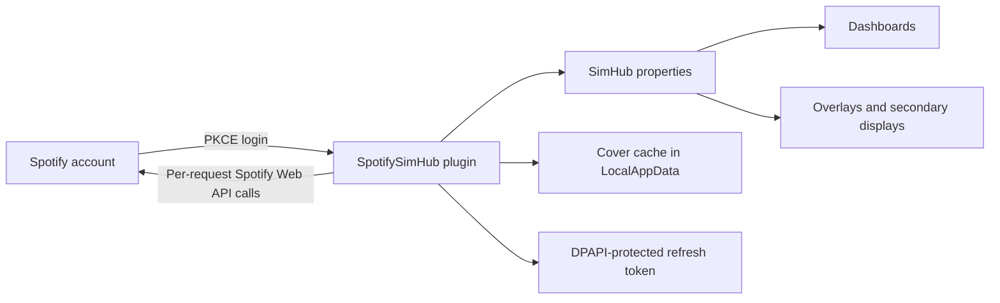

# SpotifySimHub

Bring the music you are listening to into your SimHub dashboards.

SpotifySimHub is a Windows plugin that exposes the current Spotify track, artist, album, and cover art as native SimHub properties. Dashboard authors can use those properties in overlays, button boxes, secondary displays, streaming layouts, or any other SimHub-compatible design.

## Why this plugin exists

SimHub is excellent at combining telemetry and external data into one dashboard, but Spotify playback information is not available as a built-in data source. That leaves users with awkward workarounds: separate browser overlays, manually updated text, or custom scripts that do not behave like normal SimHub properties.

SpotifySimHub fills that gap. It provides one small, local integration that:

- behaves like a regular SimHub plugin;
- works with existing dashboard expressions and image controls;
- keeps the property names stable across plugin updates;
- reconnects with a saved Spotify session;
- does not require a client secret;
- keeps tokens on the local Windows account;
- avoids opening a login page every time SimHub starts.

The goal is simple: music information should be as easy to place on a SimHub dashboard as speed, RPM, or any other property.

## What it provides

- Current artist
- Current track
- Current album
- Combined `Artist - Track` text
- Stable local cover-art path
- WPF cover image for compatible SimHub controls
- Spotify login using Authorization Code Flow with PKCE
- Automatic refresh-token reuse and rotation
- DPAPI-protected token storage for the current Windows user
- Clear Connect, Disconnect, and Refresh status controls
- Rate-limit handling, bounded retry backoff, cancellation, and request timeouts
- No automatic deployment into SimHub during build

## How it works



At startup, the plugin checks for a saved refresh token and attempts to restore the Spotify session. If no usable login exists, it reports `Login required` and waits for the user to press Connect. It never starts a new browser login automatically.

Playback is polled at a controlled interval. Bearer authorization is added only to individual Spotify API requests, and never to the token endpoint. Cover art is accepted only from HTTPS image responses, limited to 5 MB, decoded before use, and written atomically to a stable cache file.

## Exposed SimHub properties

| Property | Description |
| --- | --- |
| `Spotify.CurrentTrack` | Combined artist and track text |
| `Spotify.Artist` | Current artist |
| `Spotify.Track` | Current track title |
| `Spotify.Album` | Current album |
| `Spotify.Cover` | Stable path to the cached cover image |
| `Spotify.CoverImage` | Frozen WPF image source for compatible controls |

These property names are compatibility contracts. Existing dashboards can continue using them across plugin updates.

## Requirements

- Windows
- SimHub 9.x
- A Spotify account
- A Spotify developer application
- .NET Framework 4.8
- Visual Studio or Build Tools with the .NET Framework MSBuild toolchain when building from source

## Spotify application setup

Create an application in the Spotify Developer Dashboard and add this exact redirect URI:

```text
http://127.0.0.1:9877/callback
```

SpotifySimHub uses PKCE, so only the application's client ID is required. Do not create, copy, or store a client secret for this plugin.

## Install from a release

There is no verified release package yet. The first release should be published only after the manual SimHub and Spotify verification checklist has passed.

When a verified release is available:

1. Close SimHub.
2. Download the release package.
3. Copy `SpotifySimHub.dll` and the included plugin-owned `Newtonsoft.Json.dll` into the SimHub installation directory.
4. Start SimHub.
5. Open **Additional plugins → SpotifySimHub**.
6. Press **Connect** and complete the Spotify login.

Do not copy SimHub-hosted assemblies such as `SimHub.Plugins.dll`, `SimHub.Logging.dll`, `GameReaderCommon.dll`, or `log4net.dll` from a build directory.

## Build and install from source

### 1. Configure local build values

Copy the example properties file:

```powershell
Copy-Item `
  .\SpotifySimHub\SpotifyClientId.example.props `
  .\SpotifySimHub\SpotifyClientId.local.props
```

Edit `SpotifyClientId.local.props` and:

1. replace `YOUR_SPOTIFY_CLIENT_ID` with your Spotify application client ID;
2. set `SimHubInstallPath` to the SimHub installation directory;
3. keep the trailing directory separator in the SimHub path.

The local file is ignored by Git. Never commit it, paste its value into source code, or include it in logs, screenshots, issues, or pull requests. The build stops with a clear error when the configuration is missing.

### 2. Restore dependencies

```powershell
nuget restore .\SpotifySimHub\SpotifySimHub.sln
```

### 3. Build

Debug:

```powershell
& "C:\Program Files\Microsoft Visual Studio\18\Community\MSBuild\Current\Bin\MSBuild.exe" `
  ".\SpotifySimHub\SpotifySimHub.csproj" `
  /t:Rebuild `
  /p:Configuration=Debug `
  /p:Platform=AnyCPU `
  /m
```

Release:

```powershell
& "C:\Program Files\Microsoft Visual Studio\18\Community\MSBuild\Current\Bin\MSBuild.exe" `
  ".\SpotifySimHub\SpotifySimHub.csproj" `
  /t:Rebuild `
  /p:Configuration=Release `
  /p:Platform=AnyCPU `
  /m
```

Build output:

- `SpotifySimHub\bin\Debug\SpotifySimHub.dll`
- `SpotifySimHub\bin\Release\SpotifySimHub.dll`

### 4. Install the local build

1. Close SimHub.
2. Copy `SpotifySimHub.dll` from the selected output directory to the SimHub installation directory.
3. Copy the adjacent `Newtonsoft.Json.dll` if the required version is not already deployed with the plugin.
4. Start SimHub and open SpotifySimHub under Additional plugins.

The project deliberately has no post-build deployment command. Building the project never modifies the SimHub installation.

## Using the plugin

### Connect

Press **Connect** to start Spotify's browser login. The plugin:

1. generates a cryptographically random PKCE verifier and state;
2. listens on the local loopback callback;
3. validates the returned state;
4. exchanges the authorization code for tokens;
5. saves the refresh token using Windows DPAPI;
6. starts updating playback data.

The authorization attempt times out if it is not completed.

### Refresh status

Press **Refresh status** to refresh the saved session if necessary and immediately update the current playback state.

### Disconnect

Press **Disconnect** to:

- cancel active login, refresh, polling, and cover work;
- clear access and refresh tokens from memory;
- remove the saved refresh token;
- clear track, artist, album, and cover properties;
- remain disconnected until Connect is pressed again.

Disconnect never starts a new browser login.

## Local data and privacy

SpotifySimHub stores its runtime data under:

```text
%LOCALAPPDATA%\SpotifySimHub
```

The refresh token is encrypted with Windows DPAPI for the current user. Existing plaintext `refresh_token.txt` files are migrated only after the protected replacement has been written, read back, and verified. Access tokens, refresh tokens, and the configured client ID are not written to plugin logs.

Cover art is cached as a stable local file so dashboards do not need to depend directly on a changing remote URL.

## Troubleshooting

### Build reports missing local configuration

Create `SpotifyClientId.local.props` from the example and configure both properties. Confirm the file is inside the `SpotifySimHub` project directory.

### SimHub assemblies cannot be resolved

Verify that `SimHubInstallPath`:

- points to the directory containing `SimHub.Plugins.dll`;
- ends with a directory separator;
- is accessible to the current Windows user.

### Spotify login does not complete

- Confirm that the Spotify application contains the exact loopback redirect URI.
- Check that another application is not using local port `9877`.
- Return to SimHub and retry if the authorization attempt timed out or was cancelled.

### Login is required after restart

The saved token may have been revoked or rejected. Press Connect to create a new authorized session.

### No track is displayed

Spotify may have no active playback. Start playback on a Spotify device and press Refresh status.

### Cover art does not update

The plugin accepts only valid HTTPS image responses up to 5 MB. An invalid replacement is rejected so that a partially written image cannot replace the last valid cache file.

## Project status

The automated and offline verification covers:

- Debug and Release compilation;
- PKCE generation;
- authorization timeout configuration;
- per-request bearer authorization;
- `429 Retry-After` handling;
- DPAPI token storage and plaintext migration;
- cover content-type, size, decode, and atomic-write behavior;
- preservation of all six SimHub property names.

Live SimHub loading, real Spotify authorization, dashboard rendering, and screenshots remain part of the manual release verification. See [MANUAL_TESTING.md](MANUAL_TESTING.md).

## Contributing

Keep changes small and preserve the six public SimHub property names. Never commit:

- `SpotifyClientId.local.props`;
- generated build configuration files;
- token or cover-cache files;
- build output;
- SimHub-hosted assemblies;
- screenshots containing account details, tokens, or local secrets.

Run both Debug and Release builds before opening a pull request.
